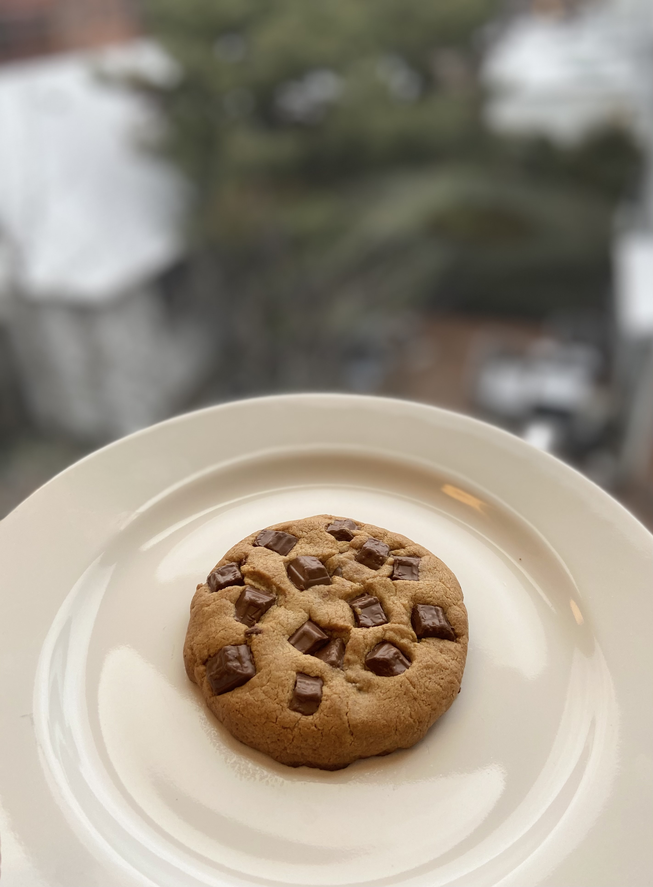

### Chocolate Chip Cookies

Most of cookies recipes are too sweet and too much for one-two people. 
This recipe makes you feel less guilty and it is super easy to follow.
Plus, this recipe does not require stand mixer and use very few kitchen supplies! 
You do the dishes less!!

_This portion serves 3 cookies_

**Required Equipments**
1. Measuring cups
2. Little pot 
3. Baking tray

**Here are ingredients**
1. Butter 1/4 cups
2. Brown Sugar 1/4 cups
3. 1 large egg
4. All purpose flour (without Gluten) 1/2 cup
5. Baking soda 1/4 teaspoon 
6. Salt 1/4 teaspoon
* Add some Vanilla is perfect, but I am going to skip that ^^

**Secret Steps** 
1. Browned the butter, browning your butter makes your cookies smell like heaven! 
Set the stove at medium heat & gently heat and stir the butter in mixing pot. 
Keep watching until it is brown.  
2. Added brown sugar and mix them well with spoon
3. Added egg yolk and half of egg white
4. Mixed them well again
5. Added flour, salt and baking soda. 
6. Mix mix mix 
7. Added some chocolate chip in cookies batter
8. Divided in to 3 cookies dough and do some decoration with more chocolate! 
9. Put them in oven at 375F, 12-15 mins
10. Enjoyed fresh baked cookies

[Go Back](README.md)
